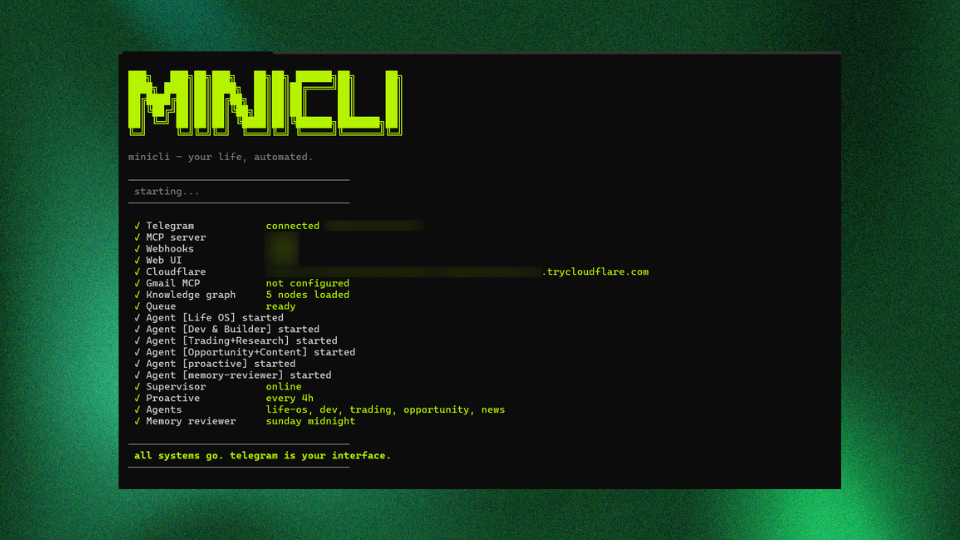

# minicli



> Your life, automated.

A personal AI agent that lives in your terminal and Telegram. One command boots a full daemon — real LangGraph agents, RAG pipeline, vector memory, tools, web UI, and public tunneling. Split-brain architecture: Node.js for infrastructure, Python for intelligence.

---

## What it does

- **Telegram interface** — send commands or plain English, get things done
- **6 real LangGraph agents** — supervisor routes to: Life OS, Dev, Research, Content, Proactive
- **Corrective RAG pipeline** — retrieves from knowledge base, grades relevance, falls back to web search, checks for hallucination
- **ChromaDB vector memory** — semantic search across memories, documents, and tasks (replaces JSON files)
- **PDF ingestion** — chunk, embed, and store PDFs on command
- **37 bridge tools** — files, shell, GitHub, Gmail, Google Calendar, TickTick, Obsidian, web search, news
- **Public web UI** — accessible from anywhere via Cloudflare tunnel

---

## Architecture

```
┌────────────────┐       HTTP        ┌─────────────────────┐
│   Node.js      │◄───────────────►│   Python (FastAPI)    │
│   :6275        │   /tool/:name    │   :6280               │
│                │   /execute       │                       │
│  • Telegram    │                  │  • LangGraph Agents   │
│  • Web UI      │                  │  • ChromaDB Memory    │
│  • Queue       │                  │  • RAG Pipeline       │
│  • 37 Tools    │                  │  • PDF Ingestion      │
│  • Tunnel      │                  │  • APScheduler        │
└────────────────┘                  └─────────────────────┘
```

- **Node.js** handles infrastructure: Telegram bot, web server, Cloudflare tunnel, tool execution
- **Python** handles intelligence: agent routing, LLM calls, memory search, RAG, scheduling
- Communication via HTTP: Python calls Node.js tools via `POST /tool/:name`, Node.js routes messages to Python via `POST /chat`

---

## Prerequisites

- Node.js 18+
- Python 3.11+
- A [Telegram bot token](https://t.me/BotFather)
- An [OpenRouter API key](https://openrouter.ai) (free tier works)
- `cloudflared` installed ([download](https://developers.cloudflare.com/cloudflare-one/connections/connect-networks/downloads/))

---

## Setup

**1. Clone and install**

```bash
git clone https://github.com/your-user/minicli.git
cd minicli
npm install
npm install -g .
```

**2. Install Python dependencies**

```bash
cd python
pip install -r requirements.txt
cd ..
```

> First run will download the embedding model (~35 MB) for local vector search.

**3. Install cloudflared**

```bash
# macOS
brew install cloudflare/cloudflare/cloudflared

# Linux
curl -L https://github.com/cloudflare/cloudflared/releases/latest/download/cloudflared-linux-amd64 -o cloudflared
chmod +x cloudflared && sudo mv cloudflared /usr/local/bin/

# Windows
winget install cloudflare.cloudflared
```

**4. Configure environment**

```bash
cp .env.example .env
```

Open `.env` and fill in at minimum:

| Variable | Description |
|----------|-------------|
| `OPENROUTER_API_KEY` | Your OpenRouter key |
| `TELEGRAM_BOT_TOKEN` | Token from @BotFather |
| `TELEGRAM_ALLOWED_USER_ID` | Your Telegram user ID (get it from @userinfobot) |

**5. Build and run**

```bash
npm run build
mini
```

You should see all services come online in your terminal. **Your Telegram bot is now live.**

On first run, existing JSON memories and knowledge graph data will be automatically migrated to ChromaDB.

---

## Optional integrations

Set these in `.env` to unlock more features:

| Variable | Feature |
|----------|---------| 
| `GITHUB_TOKEN` | PR/issue/CI tracking |
| `TICKTICK_ACCESS_TOKEN` | Task management |
| `GOOGLE_CLIENT_ID` + `GOOGLE_CLIENT_SECRET` + `GMAIL_REFRESH_TOKEN` | Gmail + Google Calendar |
| `VAULT_PATH` | Obsidian vault access |
| `OPENROUTER_MODEL` | Override the default LLM |

**Gmail/Calendar OAuth:** Run `mini` on first boot — it will walk you through browser authentication and auto-fill your refresh token.

---

## Usage

Everything goes through your **Telegram bot**. Type commands or just talk naturally.

### Commands

| Command | What it does |
|---------|-------------|
| `/today` | Daily dashboard — calendar, tasks, weather |
| `/notes` | Your 5 most recent notes |
| `/vault` | Obsidian vault file tree |
| `/find <query>` | Search files across all directories |
| `/read <filename>` | Read a vault note |
| `/gmail` | Email overview |
| `/gmail search <q>` | Search emails |
| `/news [topic]` | News briefing |
| `/memory` | Recent conversation memories |
| `/search <query>` | Semantic search across memory |
| `/status` | Full daemon status |
| `/web` | Your public web UI link |
| `/help` | All commands |

### Natural language examples

Just type — the supervisor agent routes to the right worker automatically:

```
"what's on my calendar?"       → Life OS agent (tasks, calendar)
"remind me to submit the PR"   → Life OS agent (task capture)
"any open PRs on minicli?"     → Dev agent (GitHub, code)
"tweet this: just shipped v2"  → Content agent (generation)
"latest AI news"               → Research agent (web search, news)
"summarize this PDF"           → Research agent (PDF ingestion + RAG)
```

**Smart extras:**
- Paste a URL → analyzed by the research agent
- Send a PDF → ingest into knowledge base on command
- All interactions are auto-saved to vector memory

---

## Agents

Real LangGraph agents with tool calling — not cron scripts with prompts.

| Agent | Role | Tools |
|-------|------|-------|
| 🧠 **Supervisor** | Routes messages to the right worker | All worker agents + memory + search |
| 🌅 **Life OS** | Tasks, habits, reminders, daily planning | TickTick, Calendar, memory |
| 💻 **Dev & Builder** | GitHub, code review, shell, repos | GitHub, Git, shell, filesystem |
| 🔬 **Research** | Web research, news, PDF ingestion | Web search, RSS, Obsidian, PDF ingest |
| ✍️ **Content** | Tweets, LinkedIn, READMEs | Memory, web search, Obsidian |
| 🔔 **Proactive** | Autonomous insights (every 4h) | Memory search, task check |

The proactive agent runs on a 4-hour schedule via APScheduler and sends Telegram messages when something needs attention.

---

## Memory & RAG

minicli uses **ChromaDB** for all persistence with `sentence-transformers/all-MiniLM-L6-v2` embeddings:

| Collection | What's stored |
|------------|---------------|
| `memories` | Conversations, facts, decisions, user preferences |
| `documents` | PDF chunks, ingested knowledge |
| `tasks` | Tasks, reminders, deadlines |

### Corrective RAG Pipeline

When you ask a knowledge question:

```
1. RETRIEVE  → search ChromaDB for relevant documents
2. GRADE     → LLM grades each doc for relevance
3. GENERATE  → answer from relevant docs
   └── if docs irrelevant:
       REWRITE → better search query
       WEB SEARCH → DuckDuckGo fallback
       GENERATE → answer from web results
4. HALLUCINATION CHECK → verify answer is grounded
```

### PDF Ingestion

Send a PDF path to minicli and ask it to ingest:
```
"ingest the PDF at C:/Users/me/paper.pdf"
```

The PDF is chunked (1000 chars, 200 overlap), embedded, and stored in the `documents` collection for future RAG queries.

---

## Project structure

```
minicli/
├── src/                    # Node.js infrastructure
│   ├── daemon.ts           # Startup orchestrator
│   ├── bridge.ts           # HTTP bridge (tools + Python proxy)
│   ├── python-bridge.ts    # Python server lifecycle
│   ├── telegram.ts         # Telegram bot
│   ├── queue.ts            # FIFO message queue
│   ├── web-server.ts       # Web UI
│   ├── tunnel.ts           # Cloudflare tunnel
│   └── tools/              # 37 Node.js tools
├── python/                 # Python intelligence layer
│   ├── server.py           # FastAPI entry point (:6280)
│   ├── config.py           # Environment + paths
│   ├── llm.py              # OpenRouter LLM adapter
│   ├── agents/
│   │   ├── supervisor.py   # Main routing agent
│   │   ├── life_os.py      # Life OS worker
│   │   ├── dev_builder.py  # Dev worker
│   │   ├── research.py     # Research worker
│   │   ├── content.py      # Content worker
│   │   └── proactive.py    # Proactive agent
│   ├── memory/
│   │   ├── vector_store.py # ChromaDB manager
│   │   ├── migration.py    # JSON → ChromaDB migration
│   │   └── conversation.py # Thread management
│   ├── rag/
│   │   ├── pipeline.py     # Corrective RAG graph
│   │   ├── grader.py       # Relevance + hallucination grading
│   │   └── pdf_ingest.py   # PDF chunking + embedding
│   ├── tools/
│   │   ├── bridge.py       # Node.js tool proxies
│   │   ├── memory_tools.py # Direct ChromaDB tools
│   │   └── web_search.py   # DuckDuckGo search
│   └── scheduler/
│       └── cron.py         # APScheduler (proactive, cleanup)
└── .env                    # Configuration
```

---

## Running in production

**With PM2:**
```bash
npm run build
pm2 start ecosystem.config.cjs
pm2 save
```

**With systemd (Linux):** create `/etc/systemd/system/minicli.service`, point `ExecStart` at `dist/index.js`, set `EnvironmentFile` to your `.env`, then `systemctl enable --now minicli`.

> The daemon automatically spawns the Python server as a child process. No need to run it separately.

---

## Security

- Set `TELEGRAM_ALLOWED_USER_ID` — only you can talk to your bot
- Never commit `.env` to git
- Never share `~/.minicli/` — it contains all your data and tokens
- The LLM has shell and file access — review destructive actions before confirming

---

## LLM

Uses [OpenRouter](https://openrouter.ai) with automatic fallback:

- **Primary:** `google/gemma-4-31b-it:free`
- **Fallback:** `qwen/qwen3-next-80b-a3b-instruct:free` (kicks in on rate limit)
- Override with `OPENROUTER_MODEL` in `.env`

---

## License

MIT